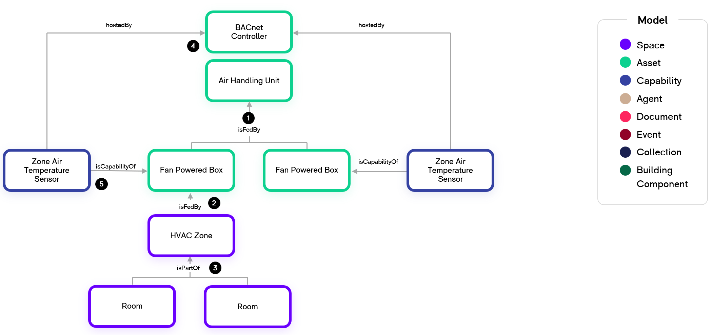

# Digital Twin Samples - HVAC

HVAC includes scenarios where temperature control and comfort of spaces is being performed by a building management system (BMS) and/or individual equipment controllers. Use cases include energy optimization, demand response, automated and predictive maintenance, and increasing productivity by improving comfort.

At a fundamental level, HVAC systems exchange energy and move air and water to condition a space. However, the configuration of HVAC systems can vary widely based on the climate of a location, size of the building, age of the building, and many other factors. While the configurations are limitless, this example shows a common scenario of conditioning air using an Air Handling Unit.

## HVAC Multi-Room Zone

1. An Air Handling Unit is one of the most complex equipment types to data model because it can come in many different configurations and be installed in many different scenarios. An Air Handling Unit has at least one inlet duct, conditions the air with cooling and heating elements, and sends the air out with at least one outlet duct. In this example, the conditioned air is sent to a Fan Powered Box which is a type of Terminal Unit. These equipment are connected via ductwork which is modeled using the isFedBy relationship. Not indicated on the relationship is the Supply Air substance which is being fed.

2. The Fan Powered Box conditions and regulates the air flow to the HVAC Zone space. The HVAC Zone is a core concept in the HVAC scenario. An HVAC Zone is a type of Space which has a boundary, generally aligns 1:1 with a Room, but can also be more granular or broader.

3. In this example, there are multiple Rooms within a single HVAC Zone. Because both Zones and Rooms are Spaces, we use the relationship isPartof to define the Rooms which are contained within the HVAC Zone.

4. In HVAC Systems, there is often a control network such as BACnet and controllers which host the control logic for the HVAC equipment. In this example, there is a single BACnet Controller which hosts the Capabilities that are associated with the Fan Powered Boxes. We use the hostedBy relationship to define which Capabilities the Controller manages.

5. Each Capability has a primary relationship to one or more Assets, Spaces, or Equipment Collections. In this example, the Zone Air Temperature Sensors each relate to a Fan Powered Box. We use the isCapabilityOf relationship to define which twin a Capability belongs to. By leveraging both the hostedby and isCapabilityOf relationships, this provides the flexibility to accommodate scenarios where an Asset’s Capabilities are hosted by separate Controllers as well as a Capability belonging to multiple entities.

6. Because a Zone Air Temperature Sensor is measuring the temperature of the HVAC Zone, we use the isCapabilityOf relationship from the Sensor to the Zone to establish the Zones temperature.

## HVAC Multi-Zone Room

1. In this example, we show the flexibility in a zone where there are multiple Zones within one Room. Because both Zones and Rooms are Spaces, we use the relationship isPartof.

2. The HVAC Zone has a Zone Air Temperature Sensor Capability which directly corresponds to the Fan Powered Box capability because there is only a single Zone Temperature Sensor.

3. In some scenarios, an equipment such as a Fan Powered Box may have several Zone Air Temperature Sensors in which there is logic in the controller which averages or takes the minimum of maximum of the multiple sensor readers to determine its control sequence.

4. When there are multiple Zone Air Temperature Sensors (#3) serving a single HVAC Zone and the connection solution doesn’t calculate and emit the aggregate for the Zone, the Zone’s Temperature Sensor Capability (#4) will need to be calculated by the WillowTwin by performing an average function.

## HVAC Basic Relationships with Level

1. In this example, we show a scenario where it is not known which rooms are being conditioned by individual HVAC equipment, but it is known that the equipment is conditioning the 1st Floor. We establish the isPartOf relationship directly from the HVAC Zone to the Level. This is common when discovering HVAC equipment via a BMS connection but not having HVAC floor plans or not wanting to establish room-level fidelity.

2. The Fan Powered Box is located on the same floor that it is conditioning which is indicated by the locatedIn relationship.

3. Rooftop Units commonly condition spaces that are not on the same level in which they are located. The Rooftop Unit here is located on the Roof but conditions the 1st Floor.
