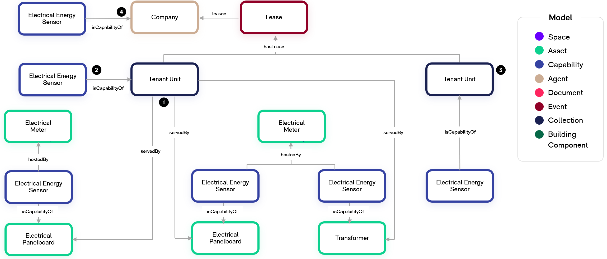

# Digital Twin Samples - Metering

Metering encompasses scenarios where a physical or virtual meter device is measuring the flow of a substance such as electricity, fluid volume, or fluid mass to determine consumption by the recipient of the substance. The recipient could be an individual asset but is often mapped to a broader concept such as a building, tenant company, or space.

## Electrical Metering

In this example, we expand upon the Electrical distribution example and introduce Electrical Metering which measures the energy, power, and current being transmitted by circuits and consumed by equipment.

1. Electrical Meters are a physical assets that have many different configurations. In this example, we show an Electrical Meter which is measuring the 3-Pole Electrical Circuit.

2. A 3-phase Electrical Meter can have many Capabilities relating to energy, power, and current for individual phases, between phases, and total. It may also compute power quality metrics such as total harmonic distortion, phase angles, and imbalance. In this example, we show an Electrical Power Sensor as just one of many Capabilities that the Meter has. We use the hostedBy relationship between the Capability and the Meter similar to how hostedBy is used with BMS Controllers.

3. The Electrical Power Sensor is measuring the Electrical 3-Phase Circuit. We use isCapabilityOf to define this relationship. This flexibility abstracts the Meter Asset hardware from the actual Capabilities it is hosting providing flexibility for many different metering scenarios. If a physical meter asset is measuring many circuits, this allows each Capability to be assigned to its associated Electrical Circuit which it is measuring.

4. In some instances, the Electrical Meter may be directly monitoring equipment (i.e. plug load meters) or individual twins of the electrical circuits may be not be created. In this example of a branch circuit meter, the Electrical Meter is trending two Energy Sensor metrics which is defined with the hostedBy relationship. The isCapabilityOf relationship assigns the Capability to a Fan Powered Box and an Exhaust Fan.

5. In some instances, a physical meter asset may be unknown or non-existent in the design. In this example, we show that the Luminaire is reporting its Electrical Current which may be a built-in Capability of that Luminaire.

## Assigning Meters to Buildings

In this example, we depict how metering measurements get assigned to a space such as a Building. 

1. The Electrical Switchgear is an electrical service entrance for the building. It has an Electrical Meter measuring the incoming circuit from the utility. We are showing one of the capabilities of the meter, Electrical Energy Sensor, which is hostedBy the Electrical Meter and isCapabilityOf the Electrical Switchgear.

2. We use the servedBy relationship from the Building to the Electrical Switchgear to indicate the service entrance relationship and thus all capabilities related to the Electrical Switchgear (i.e. Electrical Energy Sensor) can be attributed to the Building’s metering aggregate calculations.

3. Many buildings may have multiple service entrances from the utility each with their own meters. In addition to the first service entrance indicated by #1, this building has two additional service entrances indicated by #3 each with their own metering capabilities. Note that various types of Electrical Distribution Equipment may be used at electrical service entrances such as a Switchboard or Panelboard, but they can each still be attributed to the Building with the servedBy relationship.

4. Because the Building has three service entrances, the WillowTwin will calculate the aggregate energy for the building by summing up the Electrical Energy Sensors of each service entrance and assigning it to the Building in #4.

5. In other scenarios, the Building’s total energy consumption may be ingested directly into the WillowTwin. The same isCapabilityOf relationship is used in #5 as the calculated Electrical Energy Sensor in #4 which allows the WillowTwin to treat them the same regardless of how the calculation was performed by the underlying metering topology.

## Assigning Meters to Tenant Units and Companies

In this example, we replace the Building from the previous example with a Tenant Unit.

1. We indicate a similar scenario as the Building examaple above where the Tenant Unit has three meters which act as separate services for the space. The servedBy relationship is used from the Tenant Unit to each of the electrical service equipment - two Electrical Panelboards and a Transformer.

2. The WillowTwin calculates the aggregate energy for the Tenant unit by summing up each of the Electrical Energy Sensor capabilities at the service entrances.

3. Another Tenant Unit within the building has an Electrical Energy Sensor representing its energy consumption.

4. If we are interested in calculating the aggregate energy for a Company which is leasing both Tenant Units (#1 and #3), we leverage the relationship of a Company having a Lease for the Tenant Units as indicated in the Leasing Space example.
